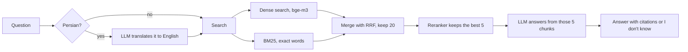
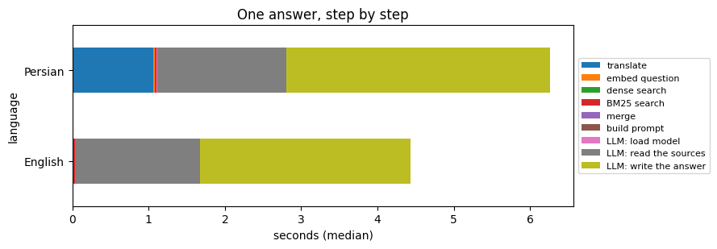
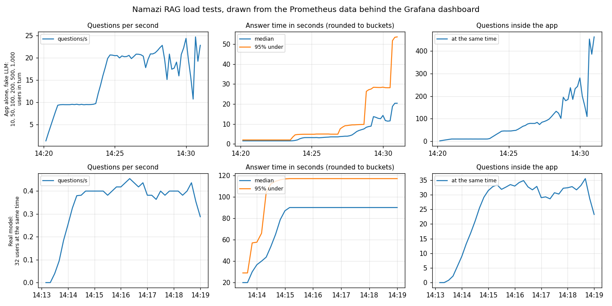

# Namazi Hospital Medical RAG

[](https://github.com/payamfirouzfar/namazi-rag/actions/workflows/tests.yml)

Ask a medical question in English or Persian and get a short answer with book and page citations. The app searches 20 public guidelines (WHO, KDIGO, GOLD), gives the best passages to a local LLM, and the LLM may only use those passages. When the books don't have the answer, it says "I don't know" and stops there.

I built it for a hospital setting where questions can't leave the network, so the LLM runs on a GPU inside that network, through Ollama. Below you'll find what it does, why it's built this way, what I measured, and what it still can't do.

**Contents:** [Examples](#examples) · [How it works](#how-it-works) · [Why these choices](#why-these-choices) · [Results](#results) · [Speed, latency and cost](#speed-latency-and-cost) · [Many users and Grafana](#many-users-and-grafana) · [Experiments](#experiments) · [What it can't do yet](#what-it-cant-do-yet) · [FAQ](#faq) · [Run it](#run-it) · [Layout](#project-layout)

## Examples

These are real answers from the running app (the guidelines are the knowledge base).

A question the books answer:

```text
Q: Which corticosteroid is preferred in bacterial meningitis?
A: Dexamethasone is the corticosteroid of choice for children and adults with bacterial meningitis [1][2][3].
   sources: WHO Meningitis Guidelines, pages 22, 72, 22, 23, 107
```

A question they don't answer (Graves disease isn't in any of the 20 books):

```text
Q: How is Graves disease treated?
A: I could not find the answer to this question in the hospital's reference books. پاسخ این پرسش در منابع موجود پیدا نشد.
```

A question with an urgent word. The emergency line comes first and the normal answer still follows:

```text
Q: I have chest pain. How is COPD diagnosed?
A: If this is an emergency (chest pain, trouble breathing, heavy bleeding, sudden weakness or thoughts of
   harming yourself), call your local emergency number now (115 in Iran). اگر وضعیت اورژانسی است ...

   COPD is diagnosed through spirometry showing a post-bronchodilator FEV1/FVC < 0.7.
```

There is also a small web page at `/` that works in Persian, with thumbs up and thumbs down for every answer.

## How it works



The books are split into chunks of about 250 words that always end at a sentence end, with 50 words of overlap so a fact on the border isn't cut in half. Every chunk is kept twice: as a vector (meaning) and in a BM25 index (exact words). The prompt tells the LLM to use only the numbered sources, cite them like `[1]`, write 2 to 4 short sentences, and reply `NO_ANSWER` if the sources don't contain the answer.

## Why these choices

Every choice below was tested against the alternatives on the same questions. The numbers come from [experiments/](experiments/README.md).

- **Hybrid search (BM25 plus embeddings).** BM25 alone finds the right passage in the top 5 for only 45% of my questions, embeddings alone for 73%, both together for 77%. BM25 earns its place with exact things like drug names, doses and abbreviations (the app expands INR, HTN, CKD and similar), and embeddings catch rephrased questions.
- **Reciprocal Rank Fusion to merge them.** It only looks at ranks, so I never have to make BM25 scores and cosine scores comparable. The dense/BM25 weight (2:1) matters little: 1:1, 2:1 and 3:1 are within a few questions of each other.
- **bge-m3 for embeddings.** I tried multilingual-e5-base (my first pick) and e5-large. bge-m3 was best for English (0.90 against 0.85) and doubled the Persian result when the question is typed in Persian (0.61 against 0.31).
- **A reranker on top.** The reranker (bge-reranker-v2-m3) reads the question together with each of the 20 best chunks and re-orders them. It costs about 0.6 s per question and moved the right passage into the top 5 for 89% of the questions instead of 77%. This was the single biggest gain after the embedding model.
- **250-word, sentence-aware chunks.** Sizes of 150, 200 and 250 words came out about the same once the reranker is on, so I kept 250. Cleaning the PDFs more (page headers, words broken by the PDF, book titles in the chunks) did not help either.
- **Qwen2.5 32B as the LLM.** It fits a 40 GB card, writes Persian well enough to use, and most importantly it refuses correctly: all 34 questions the books can't answer got "I don't know". Gemma 3 12B is 1.4 times faster but made up answers for 3 of the 18 English ones, so I left it out.
- **Translate Persian questions first.** The books are English. Searching with the typed Persian question finds the right passage 84% of the time, with the translation 92%. The price is one extra LLM call, about 0.9 s.
- **A local LLM.** Questions and answers never leave the server. The cost is speed, see below.

## Results

I tested in two ways: 141 questions I wrote about the guidelines, and 525 patient-style questions answered from public web pages. Everything below was measured with the final setup (bge-m3, reranker, Qwen2.5 32B, the short prompt).

### The guideline questions

141 questions (76 English, 65 Persian). 107 have an answer in the books and 34 don't. Each answerable question has an evidence phrase copied from the books, which is how I know whether the right passage was found.

| Search (all 107 answerable questions, right passage in the top 5) | Hit rate |
|---|---|
| BM25 only | 0.449 |
| embeddings only | 0.729 |
| BM25 + embeddings (2:1) | 0.766 |
| BM25 + embeddings + reranker (used) | **0.888** |

By language, with the reranker: English 0.93 (MRR 0.82), Persian typed as is 0.84 (MRR 0.73), Persian translated 0.92.

| Answers (real LLM) | English | Persian |
|---|---|---|
| answerable questions | 58 | 49 |
| right passage reached the LLM | 56 | 45 |
| answer cited the right passage | 52 | 41 |
| unanswerable questions (of 18 / 16) answered with "I don't know" | 18 | 16 |
| answers with a number that isn't in any source | 0 | 0 |
| answers the LLM judge found unsupported | 0 | 0 |

When I started (e5 embeddings, no reranker) the right passage was cited 46 and 34 times, and 2 Persian questions got made-up answers. Every answer is in [docs/answer_check.csv](docs/answer_check.csv).

### The patient questions

525 questions, each in English and Persian ([the csv](data/eval/patient_questions_english_persian_525.csv)). 500 cover 25 common conditions, 20 questions each (diabetes, asthma, high blood pressure, COPD, depression, kidney disease and others). 25 are paraphrased from questions on public Iranian patient Q&A sites, about pregnancy and rheumatic diseases. They're answered from 25 public pages (MedlinePlus, NHS, WHO, NIMH, NIDDK) that `scripts/fetch_sources.py` downloads into a separate knowledge base.

The file names the pages each question belongs to but has no reference answers. So I can't say "this answer is correct". I measure whether it answers or says "I don't know", whether it cites the named page, whether the numbers appear in the sources, and what the LLM judge thinks.

| 420 questions per language | English | Persian |
|---|---|---|
| answered | 297 (71%) | 314 (75%) |
| "I don't know" | 123 | 106 |
| answers citing the expected page | 293 of 297 (99%) | 305 of 314 (97%) |
| answers with a number in no source | 1 | 2 |
| answers the LLM judge doubts | 20 (7%) | 84 (27%) |

The other 210 questions have no page to answer from (flu, COVID, stroke and breast cancer pages could not be downloaded, plus the 50 forum-style questions). 187 of them got "I don't know". The 23 answers came from nearby pages, like the asthma page talking about flu.

Persian is the weak spot. The right page reached the LLM for 415 of 420 questions, so the search is fine. It's the LLM's Persian that is awkward, and the judge (the same model, reading Persian worse than English) doubts 27% of those answers. The pages also say little about missed doses (95% "I don't know"), follow-up visits and side effects (90% each) and how to ask about test results (86%).

## Speed, latency and cost

Measured on one A100 40 GB, one question at a time:



| | English | Persian |
|---|---|---|
| median time per answer | 3.4 s | 4.8 s |
| 95% of answers under | 5.0 s | 6.9 s |
| slowest | 14.2 s | 7.4 s |

For an English answer, reading the 5 chunks takes about 1.65 s (49%), writing the answer 1.1 s (33%), the reranker 0.6 s (17%). Embedding, dense search and BM25 together take about 40 ms. A Persian question also needs the translation call, 0.9 s. The step times come from `scripts/time_steps.py`.

The first question after a quiet period is slower: 12 s in my last check, because Ollama had unloaded the model and had to load it again. Setting `OLLAMA_KEEP_ALIVE` keeps it in memory, at the price of holding the GPU memory.

Cost for 10,000 questions on a paid API, using 2,146 prompt and 52 answer tokens per question (prices from summary sites on 2026-10-08, sources in [docs/api_prices.csv](docs/api_prices.csv), please check the official pages):

| Model | 1,000 questions | 10,000 questions |
|---|---|---|
| GPT-5 mini | $0.64 | $6.40 |
| Claude Haiku 4.5 | $2.40 | $24.03 |
| GPT-5 | $3.20 | $31.98 |
| Claude Sonnet 5 | $4.81 | $48.07 |

The local model has no per-token price. It costs a GPU server: about 7 hours of one A100 for 10,000 questions, and the questions never leave the network.

## Many users and Grafana

`scripts/load_test.py` sends many questions at once. First the app alone, with a fake LLM that waits one second (`scripts/fake_llm.py`), so only the search, database and API are tested:

| Users at the same moment | Answered (of 2,000) | Questions per second | Median / 95% wait |
|---|---|---|---|
| 10 | 2,000 | 9.5 | 1.1 s / 1.1 s |
| 100 | 2,000 | 21.5 | 4.5 s / 5.5 s |
| 500 | 1,991 | 19.4 | 25.5 s / 32.9 s |
| 1,000 | 1,999 | 19.3 | 49.9 s / 53.8 s |

One run with **10,000 users** (100 at a time) answered all 10,000, at 23 questions per second. Past 200 simultaneous users a few requests (at most 0.5%) were dropped with a `ReadError`. The app logged no error, and my guess is a connection closed while the client reused it, but I haven't proven that. The first 10,000-user run also found a real bug: a progress bar in the embedding library crashed when many questions were embedded at once. It's fixed and has a test.

Then the real model, 4 questions in parallel in Ollama:

| Users at the same moment | Answered | Median / 95% wait |
|---|---|---|
| 8 | 400 of 400 | 17.8 s / 31.6 s |
| 32 | 128 of 128 | 75 s / 91 s |
| 128 | 256 of 256 | 226 s / 442 s |

One GPU makes about 0.4 answers per second, so the wait is roughly the number of users divided by 0.4. Nothing failed, but 128 users at once means the slowest waited 7 minutes. The app isn't the limit, the GPU is. More GPUs, a smaller model or a faster model server would raise it. These two load tests ran before I added the reranker, so each answer is now a bit slower but shorter.

Monitoring uses Prometheus and Grafana. The app exposes `/metrics`, and the dashboard ([docs/grafana_dashboard.json](docs/grafana_dashboard.json)) has seven panels: questions per second, median and 95% answer time, errors, share of "I don't know", tokens per minute, questions in progress, and what the tokens would cost on a paid API. [docs/alerts.yml](docs/alerts.yml) has four alerts: app down, errors rising, slow answers, too many "I don't know".



There's no browser on the server, so this picture is drawn from the same Prometheus data and queries as the Grafana panels. The top row is the app alone from 10 to 1,000 users, the bottom row the real model with 32 users. The app now times the whole request, so waiting for a free worker shows up in the answer time.

## Experiments

Each question I asked has its own script in [experiments/](experiments/README.md), with the saved results next to it.

| What I tried | Result |
|---|---|
| cleaning the books (page headers, broken words, titles) | no gain |
| e5-base, e5-large, bge-m3 | bge-m3 wins, Persian typed 0.31 to 0.61 |
| dense/BM25 weights | all close |
| a reranker | **kept**, hit@5 0.77 to 0.89 |
| chunks of 150, 200, 250 words | same once the reranker is on |
| a prompt that answers part of a question | worse (cited the right page less often) |
| a prompt with 2 to 4 short sentences | **kept**, same quality, about 10% shorter |
| Gemma 3 12B instead of Qwen 32B | faster, but made up English answers |

Some mistakes along the way are worth owning. My first "join broken words" fix did nothing, because the PDF text still had the ligature glyph when I ran it. The first count of "numbers in no source" treated the 1. 2. 3. of numbered lists as facts (11 and 26 answers, really 0 and 1). I called the INR warfarin question unanswerable, but the books do give "INR 2-3" in a KDIGO 2024 table. And 10 English answers ended with the literal word `NO_ANSWER`, because the model explained first and the app only looked at the start of the reply.

## What it can't do yet

- No clinician has read the answers. [docs/doctor_review.csv](docs/doctor_review.csv) has 100 of them (made by `scripts/review_sample.py`) with empty columns for "correct?" and "safe for a patient?". Until someone fills it in, all I know is that the answers follow the sources.
- Persian wording is weaker than English, as above.
- My question sets are small and I wrote them. "No unanswerable question got an answer" rests on 34 questions and a judge that is the same model as the answerer. I wrote the 141 questions from the book sentences, which suits exact-word search better than real questions would.
- The knowledge base has gaps: flu, COVID, stroke and breast cancer, and little on follow-up, missed doses and test results. The licence of each web page is unchecked.
- One GPU, about 0.4 answers per second.
- No HTTPS (nginx notes are in [docs/DEPLOY.md](docs/DEPLOY.md), untested), no user accounts (only API keys), no privacy policy for patient questions. Health software can fall under medical-device rules, so ask someone who knows your country's.
- Docker files are included, but the Docker service wasn't running on my test server, so I never ran them.
- Answers are reference text from books, not medical advice.

| | Built | Not yet | Not planned |
|---|---|---|---|
| Search | hybrid search, reranker, Persian questions | Persian source pages, searching with both the typed and translated question | |
| Answers | citations, "I don't know", emergency line | streaming, an answer cache, a second check that the answer matches the question | diagnosis or treatment advice beyond the books |
| Running it | metrics, alerts, load test, CI, backups, systemd | HTTPS, accounts, vLLM or another faster server | |

## FAQ

**Why not just ask ChatGPT?** Questions would leave the network, and a general model answers even when it doesn't know. This app can only use the books and says so when they don't have the answer.

**Why Ollama and not vLLM?** Ollama was simple to set up on a shared server with little free disk. vLLM would serve many users at once much better, but it needs the original model weights (far more disk) and a matching CUDA setup. It's the next thing I'd try.

**Can I use another LLM?** Yes. Any OpenAI-compatible server works: set `LLM_BASE_URL` and `LLM_MODEL` in `.env`. Check how it refuses with `scripts/check_answers.py` first, because that's where models differ most.

**Can I use my own books?** Put PDFs, TXT or MD files in `data/books/`, run `python -m scripts.ingest`, and write 50 to 100 questions with an evidence phrase for `scripts.tune` and `scripts.check_answers`. [docs/TUNING.md](docs/TUNING.md) explains every setting.

## Run it

Quick start with the 4 tiny sample files and the offline test embedder (no downloads):

```bash
python -m venv .venv && source .venv/bin/activate
pip install -r requirements-dev.txt
python -m pytest                                    # 128 tests, a few seconds

export EMBEDDING_MODEL=hash RERANK_MODEL=
python -m scripts.ingest --books data/sample
uvicorn app.main:app_factory --factory --port 8000  # needs an LLM, see LLM_* in .env.example
```

With your own books:

```bash
cp .env.example .env            # set LLM_* and API_KEYS
python -m scripts.ingest        # downloads bge-m3 (about 2 GB); the reranker downloads on the first question
python -m scripts.tune          # find good settings on your own questions
uvicorn app.main:app_factory --factory --host 127.0.0.1 --port 8000
```

`walkthrough.ipynb` runs every step with its results and plots (the saved outputs are already in it). Setup on a server, backups, systemd services, Prometheus, Grafana and nginx are in [docs/DEPLOY.md](docs/DEPLOY.md).

```bash
curl -X POST localhost:8000/v1/ask \
  -H "X-API-Key: $KEY" -H "Content-Type: application/json" \
  -d '{"question": "What is the target INR for a patient on warfarin?"}'
```

| Endpoint | What it does |
|---|---|
| `POST /v1/ask` | `{question, top_k?}`, returns the answer, the sources and `answered: false` when the books have nothing |
| `POST /v1/feedback` | `{conversation_id, feedback: 1 or -1, comment?}` |
| `GET /` | the question page |
| `GET /health`, `GET /ready` | the process is up, the index is loaded |
| `GET /metrics` | numbers for Prometheus |

Errors: `401` bad API key, `422` bad input, `429` rate limit, `503` LLM or index unavailable. The code also has a per-caller rate limit, constant-time API key checks, parameterized SQL, request ids in every log line, retries with backoff when the LLM fails, and an index that is written to a temp folder and swapped in, so a failed ingest can't break the running one. With `LOG_QUESTIONS=false` only a hash of the question is stored.

## Project layout

```
app/          main.py (API) · rag.py (prompt, answer logic) · retriever.py (hybrid search, RRF, reranker)
              index.py · chunking.py · text.py · loader.py · embedder.py · llm.py · metrics.py
              db.py · security.py · schemas.py · config.py · logger.py
scripts/      ingest.py · tune.py · check_answers.py · report.py · load_test.py · fake_llm.py
              time_steps.py · fetch_sources.py · review_sample.py
experiments/  one script per experiment, results/, and a write-up
tests/        128 tests, no downloads and no network
walkthrough.ipynb   everything above, step by step, with plots
data/         books/ · sample/ · eval/ (questions) · index/ (generated)
docs/         BOOKS.md · TUNING.md · DEPLOY.md · the saved results (csv, png) · prometheus.yml · alerts.yml · grafana_dashboard.json
```
